# Figures for the paper

Here are all the figures in their full uncompressed glory. ALmost all of these (expect FigS5) were made by editing the output of the MATLAB scripts in Inkscape

## Main figures

### Figure 1

### Figure 2

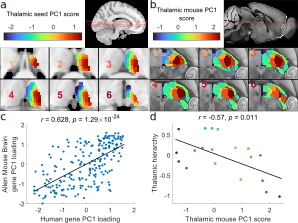

### Figure 3

### Figure 4

## Supplementary figures

### Figure S1

### Figure S2

### Figure S3

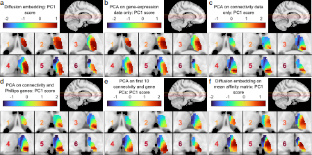

### Figure S4

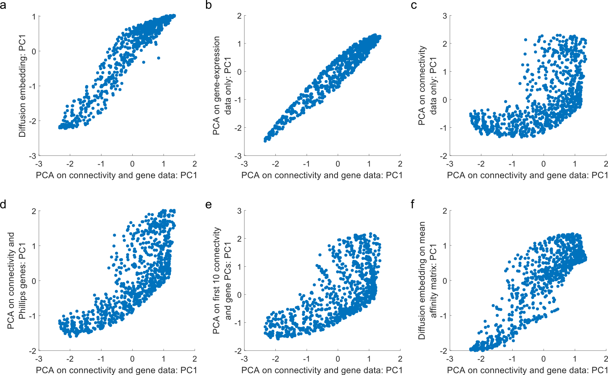

### Figure S5

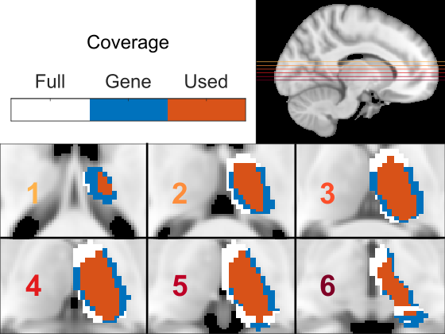

### Figure S6

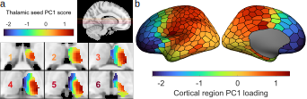

### Figure S7

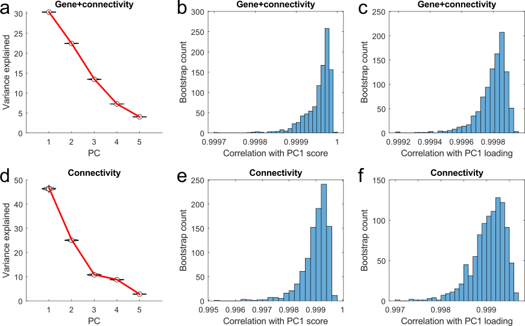

### Figure S8

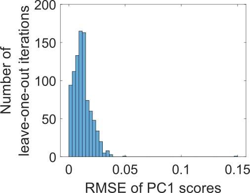

### Figure S9

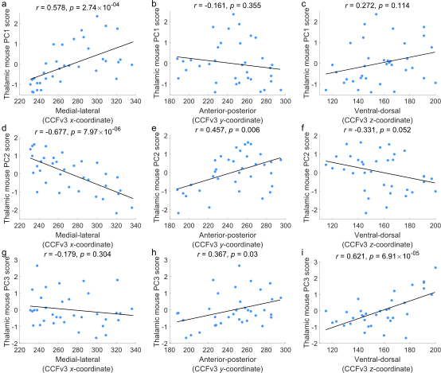

### Figure S10

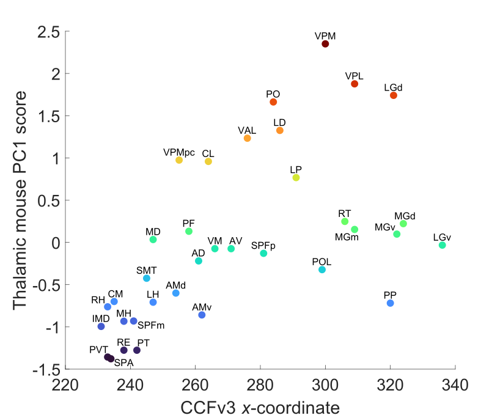

### Figure S11

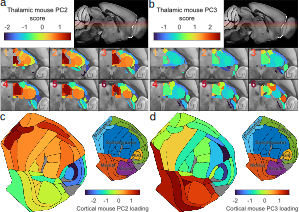

### Figure S12

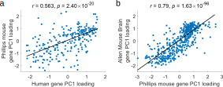

### Figure S13

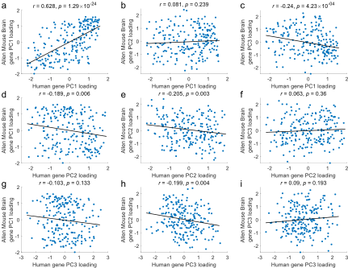

### Figure S14

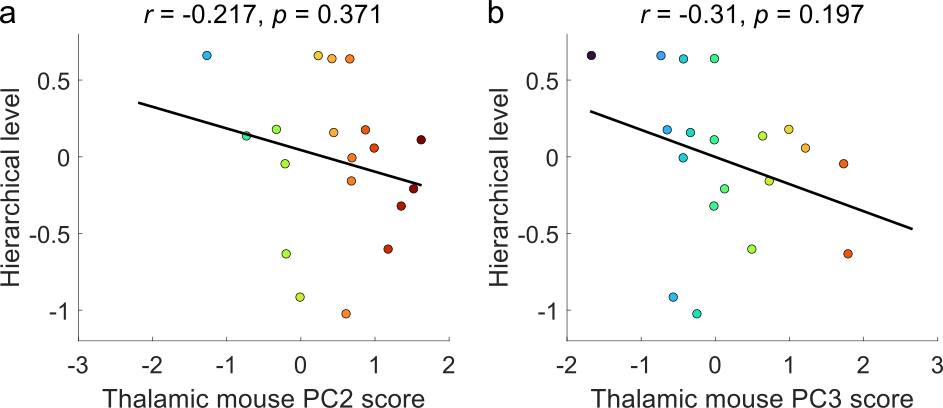

### Figure S15

### Figure S16

### Figure S17

### Figure S18

### Figure S19

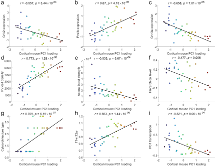

### Figure S20

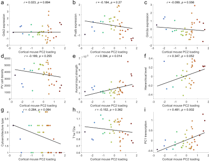

### Figure S21

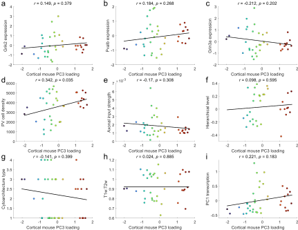

### Figure S22

### Figure S23

### Figure S24

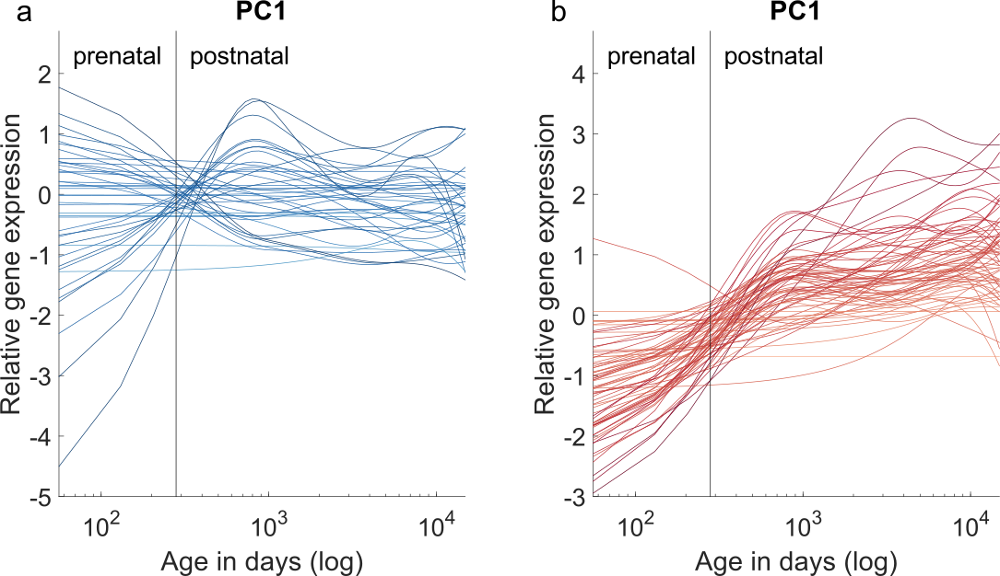

### Figure S25

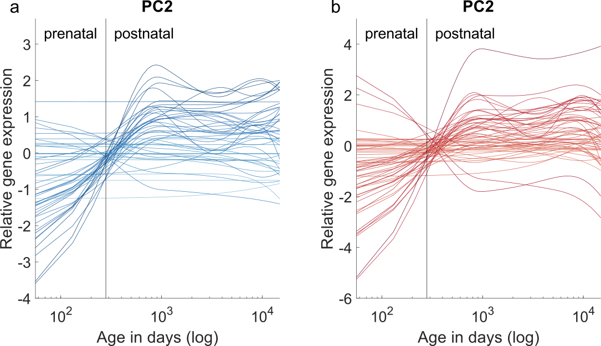

### Figure S26

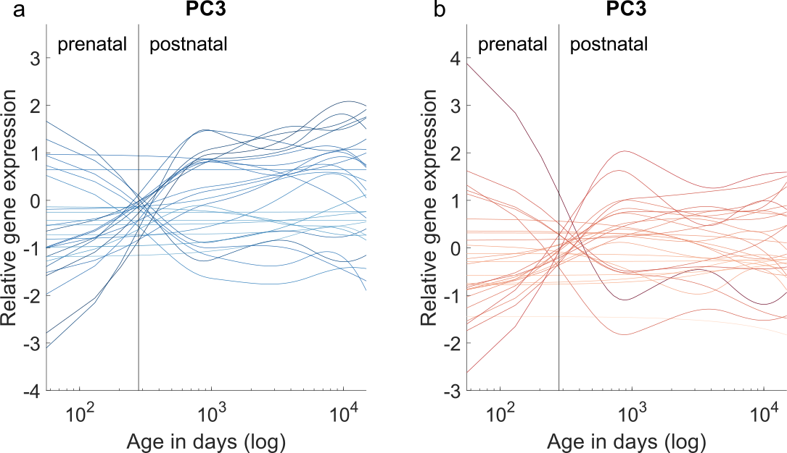